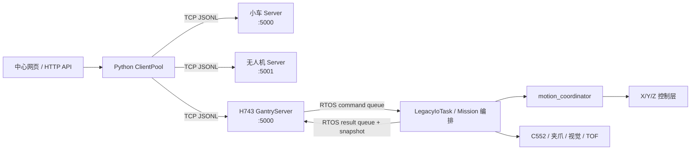
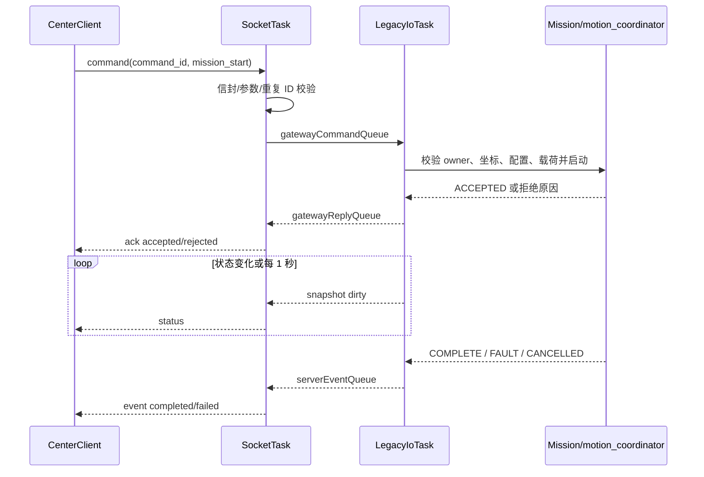

# 智慧救援项目总结与 STM32H743 龙门架 Server 实现指南

> 文档日期：2026-08-21  
> 目标读者：负责 STM32H743、FreeRTOS、LwIP 以及中心端通信联调的开发者  
> 本文目标：记录龙门架作为 TCP Server 接入 Python 通信中心的现行实现、协议契约和后续验收要求。

## 1. 结论先行

当前系统采用“中心主动连接设备”的模式：Windows/Python 中心是 TCP Client，小车、无人机和龙门架都是 TCP Server。龙门架不应再设计成主动连接中心的 Client，也不应让网络任务直接调用电机、夹爪或任务状态机。

推荐方案如下：

1. H743 保留现有 FreeRTOS、LwIP、P7 任务状态机、三轴控制和 `motion_coordinator`。
2. TCP 5000 已升级为 UTF-8 JSON Lines 协议，设备身份固定为 `gantry`，中心身份固定为 `center`。
3. H743 的网络层只完成收包、校验、命令去重、回包和状态上报；业务命令通过 RTOS 队列交给 `LegacyIoTask`/任务编排层。
4. 中心端新增第三个设备标识 `gantry`，复用现有 `CenterClient` 和 `ClientPool`，并补充龙门架命令校验、配置和测试。
5. V1 已开放任务级命令、受保护的 X/Y/Z 单轴相对运动、Z 轴人工设零和 Z 轴故障清除；不开放无限位自动回零、软限位修改或标定参数写入。

截至 2026-08-21，H743 端 V1 协议、TCP Server 和参考 Python 客户端已经落地。板上已验证 `hello`、完整 `status`、1 秒状态周期、2 秒 heartbeat 和 `status_query` 的 ACK/最终 event；运动类命令仍须按第 10 章逐项完成机械安全测试。

物理设备 IP 不同，所以小车和龙门架都使用 TCP 5000 不冲突；如果在同一台电脑上做三设备模拟，龙门架模拟端改用 5002。

## 2. 信息来源与可信边界

本文依据以下内容整理：

- 当前工作区 `Socket/`：中心端、小车 Server、无人机 Server 和协议的实际 Python 代码。
- 当前工作区 `H_ALIGNER/`：无人机 YOLO/RKNN 与 AprilTag 检测/对中 ROS 服务。
- 当前工作区 `小车已知代码/`：小车 ROS 导航脚本和相关工程。
- 用户提供的 `D:/Downloads/legacy-migration-status.md`：2026-08-16 的 H743 当前业务迁移总结。

H743 的能力和安全语义以用户提供的迁移总结为基线；中心通信协议以当前工作区 `Socket/` 的实际代码为基线。

## 3. 当前项目结构总结

### 3.1 通信中心 `Socket/`

中心项目是 Python 3.10+ 包 `smartcar_comm`，当前版本为 0.2.0。

主要模块：

| 文件 | 责任 |
|---|---|
| `Socket/smartcar_comm/protocol.py` | JSON 消息封装、解码、通用字段校验，以及小车/无人机命令校验 |
| `Socket/smartcar_comm/center_client.py` | 单设备 TCP 长连接、重连、心跳、命令状态记录 |
| `Socket/smartcar_comm/client_pool.py` | 同时管理小车和无人机的多个 `CenterClient` |
| `Socket/smartcar_comm/car_server.py` | 小车端 TCP Server；把中心命令映射为 ROS 导航进程 |
| `Socket/smartcar_comm/drone_server.py` | 无人机端 TCP Server；管理 ROS 指令、手动速度、对中、示教和急停 |
| `Socket/smartcar_comm/web_panel.py` | 中心网页和 HTTP API |
| `Socket/config/center.json` | 中心连接的小车、无人机地址及网页配置 |

中心的关键行为：

- 每个设备有一条独立、自动重连的 TCP 长连接。
- 连接后，设备必须首先发送 `hello`。
- 中心和设备互发心跳；默认 2 秒一次，中心 7 秒收不到设备心跳即判离线。
- 可靠命令使用 `command_id`，状态依次为 `sent -> accepted -> completed/failed`，也可能直接 `rejected`。
- 中心断线后不会自动重发正在执行的命令，而是把它标记为 `communication_failed`。
- 现有协议使用一行一个 JSON 对象，以 `\n` 结尾，单帧上限为 64 KiB。

当前缺口：

- `protocol.py` 只定义了 `car` 和 `drone`。
- `validate_device_command()` 不接受 `gantry`。
- `load_pool_config()` 只遍历 `car`、`drone`。
- 网页没有龙门架页面。

`ClientPool` 的主体逻辑已经是按 `device_id` 泛化的，加入第三台设备不需要重写连接管理器。

### 3.2 小车端

小车运行 `car_server.py`，默认监听 5000。中心命令被映射到已有 ROS 导航脚本：

| 中心命令 | 导航位置 |
|---|---|
| `navigate_origin` | 原点 `0` |
| `navigate_pickup_area` | 取货区 `5` |
| `navigate_loading_area` | 装载区 `6` |
| `navigate_landing_pad` | 救援点 `x.1` |
| `navigate_unloading_area` | 卸货区 `x.2` |

小车 Server 是龙门架可靠命令生命周期的最小参考：先回 `accepted`，后台执行，最后回 `completed` 或 `failed`；重复的 `command_id` 不再次执行，而是重放历史结果。

### 3.3 无人机端与 `H_ALIGNER/`

无人机 Server 默认监听 5001，除可靠命令外还支持带序号的连续速度 `control` 消息。可靠命令覆盖起飞、降落、云台、RKNN/AprilTag 检测对中、示教和急停。

`H_ALIGNER/src/h_detector_bridge` 提供固定名称 `/h_detector` 的 ROS 服务：

- `0` 查询；
- `1/2` 启动 RKNN 或 AprilTag 对中；
- `3` 停止检测和控制；
- `4/6` 单次识别；
- `5/7` 持续调试但不控制飞机。

无人机 Server 对龙门架最有价值的参考不是 ROS 调用，而是以下设计：

- 网络连接与业务执行分层；
- 手动、自动、示教之间有唯一控制所有者；
- 急停优先于普通命令；
- 状态通过独立 `status` 消息持续上报；
- 断线、超时和重复命令都有明确语义。

### 3.4 H743 龙门架当前能力（依据用户提供的 2026-08-16 总结）

H743 当前主工程已包含：

- FreeRTOS、LwIP、Ethernet 和 TCP 5000；
- X/Y 两轴 FDCAN2 控制、Z 轴 USART6 协议、C552 USART3 DMA；
- 三轴坐标、软件限位、故障和非阻塞完成反馈；
- `motion_coordinator` 对 MANUAL、P2、P3、对正、P4、MISSION 的互斥仲裁；
- P6 公共任务子流程；
- P7 四任务状态机：`red_pick`、`red_find`、`tag_put`、`frame_put`；
- EEPROM 保存标定、任务配置、预设位和安全位；
- 全局 `abort` 锁存到重启；普通取消或单轴故障不产生全局锁存；
- IWDG 约 2 秒，关键任务按心跳联合喂狗。

2026-08-16 总结记录的实机状态是：`red_pick`、`red_find`、`tag_put` 完整通过，`frame_put` 尚未完成整链验证。

## 4. 目标系统拓扑



职责边界：

- 中心：连接、重连、命令 ID、状态展示和跨设备流程编排。
- H743 网络层：协议和传输，不决定运动细节。
- H743 业务层：判断前置条件、取得运动 owner、执行任务、取消、故障和安全撤离。
- `motion_coordinator`：仍是运动权限和全局急停的唯一权威。

## 5. 龙门架通信协议

### 5.1 传输层

- TCP Server，默认监听 `0.0.0.0:5000`。
- UTF-8 JSON Lines：每条消息是一个 JSON 对象，以单个 `\n` 结束；接收时允许并忽略 `\r`。
- 禁止假设一次 `recv()` 等于一条消息；必须同时处理拆包和粘包。
- 中心通用上限为 64 KiB；H743 Profile 建议将自身可接受帧限制为 2048 字节，并在 `hello.max_frame_bytes` 中声明。中心发往龙门架的 V1 命令必须小于该值。
- H743 只服务一个活动中心连接。当前监听 backlog 为 1，额外连接只能等待，不能收到 `hello` 或提交命令；中心端不得并发启动第二条龙门架连接。后续若要求立即拒绝第二连接，需要独立会话管理或非阻塞 accept 设计。
- Server 监听异常后延迟重建；单个 Client 断开只关闭 Client socket，监听 socket 保持工作。
- 设置接收超时或用 `select()` 周期唤醒，网络任务不能永久阻塞在 `recv()`，否则无法定时发送心跳和状态。
- 当前实现接收超时为 100 ms，发送 socket 超时为 1000 ms；一次完整发送另设 3000 ms 总期限。
- 当前 LwIP `TCP_SND_BUF` 约 1072 字节，而实测完整状态帧为 1121 字节，不能假设一帧可一次写入发送缓冲。`send_all()` 按当前 TCP MSS 536 字节分块，启用 `TCP_NODELAY`，并对 `EAGAIN/EWOULDBLOCK` 在总期限内重试；临时无发送空间不是断线。
- RX 行缓冲和 TX 编码缓冲均为静态 2048 字节，不能放在 4 KiB SocketTask 栈上。

### 5.2 通用信封

必须与 `Socket/smartcar_comm/protocol.py` 一致：

```json
{
  "type": "command",
  "device_id": "center",
  "msg_id": "14fd8954-c574-4f6d-a63b-00bd150ff480",
  "timestamp": "2026-08-21T08:30:00.000Z",
  "payload": {}
}
```

| 字段 | 类型 | 规则 |
|---|---|---|
| `type` | string | `hello`、`heartbeat`、`command`、`ack`、`event`、`status`、`error` |
| `device_id` | string | 中心发出时为 `center`；H743 发出时固定为 `gantry` |
| `msg_id` | string | 每个网络消息唯一；不是业务 `command_id` |
| `timestamp` | string | 非空；有 UTC 时用 ISO-8601，无 RTC 时可暂用 `uptime:<ms>`，中心不得把它当作绝对时间 |
| `payload` | object | 随消息类型变化 |

H743 必须拒绝 `device_id != "center"` 的入站消息。

建议 H743 的 `msg_id` 使用固定内存生成，例如 `g-<boot_id>-<uint32_seq>`，不需要在 MCU 上生成 UUID。

### 5.3 连接建立与心跳

H743 接受连接后，第一条发给中心的消息必须是 `hello`：

```json
{"type":"hello","device_id":"gantry","msg_id":"g-27-1","timestamp":"uptime:1450","payload":{"protocol_version":1,"firmware":"TestH743","build":"2026-08-21","role":"gantry","max_frame_bytes":2048,"capabilities":["mission_start","mission_cancel","axis_move","axis_stop","axis_status","emergency_stop","payload_set","status_query","config_query","z_set_zero","z_clear_fault"],"tasks":["red_pick","red_find","tag_put","frame_put"],"axes":["x","y","z"]}}
```

随后立即发送一份完整 `status`。H743 每 2 秒主动发送一次：

```json
{"type":"heartbeat","device_id":"gantry","msg_id":"g-27-2","timestamp":"uptime:3450","payload":{"status":"online","uptime_ms":3450}}
```

同时接收中心发来的 `heartbeat`。建议 H743 记录中心最后活动时间，但不要仅因网络心跳丢失而触发全局 `abort`：

- 已接受的自动任务可继续按本地安全状态机执行；
- V1 不提供连续远程点动，因此没有需要依赖网络看门狗维持的运动；
- 网络恢复后由 `status` 和命令去重记录恢复可观测性；
- 真正急停使用独立的 `emergency_stop` 命令和现场硬件急停。

如果以后开放点动，则点动必须有 300～500 ms 的独立控制看门狗，断线立即停轴，但仍不能把点动看门狗超时等同于全局 ABORT 锁存。

### 5.4 V1 命令集

设备命名空间已经由 `device_id=gantry` 隔离，所以命令名不再重复加 `gantry_` 前缀。

| 命令 | `target` | 完成条件 | H743 业务映射 |
|---|---|---|---|
| `mission_start` | `{"task":"red_pick\|red_find\|tag_put\|frame_put"}` | 对应 P7 任务进入 `COMPLETE` | 等价于受校验的 `mission_start <task>` |
| `mission_cancel` | `{}` | 活动任务和参与运动的轴已进入安全停止终态 | 等价于任务级取消；不产生全局锁存 |
| `axis_move` | `{"axis":"x\|y\|z","delta_pulses":整数}` | 指定轴到达目标并进入 `IDLE` | 复用现有 X/Y/Z 受限相对运动接口，owner 为 `MANUAL` |
| `axis_stop` | `{"axis":"x\|y\|z"}` | 指定轴停止并退出 `MOVING` | 单轴局部停止；不停止其他轴，不产生全局锁存 |
| `axis_status` | `{}` 或 `{"axis":"x\|y\|z"}` | 已发送包含对应轴的完整 `status` | 只读查询，不取得运动 owner |
| `emergency_stop` | `{}` | ABORT 已锁存，X/Y/Z 停止请求已发出，夹爪已冻结 | 等价于全局 `abort`，绕过普通 owner |
| `payload_set` | `{"state":"held|empty"}` | 逻辑载荷状态已更新 | 等价于 `mission_payload held|empty` |
| `status_query` | `{}` | 已发送一份完整 `status` | 聚合 `mission_status`、`motion_status`、三轴和设备状态 |
| `config_query` | `{}` 或 `{"task":"..."}` | 已发送配置状态快照 | 只读查询任务配置及 EEPROM 有效性 |
| `z_set_zero` | `{}` | Z 轴当前位置被设为 0，坐标转为有效 | 复用 `ZAxisControl_SetZero()`；仅允许无 owner、无活动任务且 Z 轴空闲时执行 |
| `z_clear_fault` | `{}` | Z 轴故障清除流程结束并回到 `IDLE/NONE` | 复用 `ZAxisControl_ClearFault()` 并等待异步恢复终态 |

V1 明确不提供：

- X/Y/Z 绝对位置命令和多轴同步插补；
- 无限位自动回零，以及 X/Y 轴人工设零和故障清除；
- P2/P3 标定和 P4 独立调试；
- 软限位、矩阵、速度、任务目标或安全位姿写入；
- 远程清除全局 ABORT。全局 ABORT 保持到设备重启。

这些能力继续使用现场 Shell 和人工安全流程，避免网页误操作绕过标定与坐标前置条件。

`z_set_zero` 是人工设零，不会寻找机械原点。中心界面必须在发送前要求操作员确认 Z 轴已经人工移动到真实机械零位；固件只检查运动 owner、任务状态和轴空闲状态，无法判断当前位置是否真是机械零位。`z_clear_fault` 只清除 Z 轴故障，不清除全局 ABORT 锁存。

### 5.5 单轴控制语义

#### 5.5.1 `axis_move`

中心发送相对运动，例如 X 轴正向 51200 脉冲：

```json
{"type":"command","device_id":"center","msg_id":"m-axis-1","timestamp":"2026-08-21T08:30:10.000Z","payload":{"command_id":"900a97d5-fad5-4b07-af8f-af80fc3bbf66","name":"axis_move","target":{"axis":"x","delta_pulses":51200}}}
```

协议规则：

- `axis` 只能是小写 `x`、`y`、`z`。
- `delta_pulses` 必须是非零有符号整数，协议层按 `int32_t` 接收，计算目标位置时必须先提升为 `int64_t` 防止溢出。
- 正负方向沿用 H743 本地坐标定义；Z 正方向为远离机械零点，负方向为接近机械零点。
- 第一版不允许中心指定频率、加速度或驱动器参数，继续使用 H743 已板测的轴默认值。
- 单次远程相对运动上限沿用当前统一单步限制：X `512000`、Y `10000`、Z `57600` 脉冲。超过上限直接 `rejected/STEP_TOO_LARGE`，不能在固件内静默裁剪。
- `current_position + delta_pulses` 必须落在该轴现有软件范围内；越界直接 `rejected/SOFT_LIMIT`。
- X/Y/Z 均要求坐标有效、轴无故障且 `IDLE`。虽然本地 Shell 允许未引用 Z 轴相对点动寻找零点，远程网络 V1 不开放这一例外。
- 一次只允许一个远程 `axis_move` 活动；命令从接受到终态持续持有 `MOTION_OWNER_MANUAL`，防止另一个网络、Shell、标定或任务命令插入。

完成规则：

- X/Y 进入现有正常完成条件时 `completed`，包括目标应答完成或允许的 `completion=TOLERANCE`。
- Z 收到控制器完成并回到 `IDLE` 后 `completed`。
- 轴 FAULT、通信超时、坐标失效或被停止时 `failed`，并返回稳定原因。
- 网络任务只提交动作并观察业务事件，不能自行根据时间推算“应该已经到达”。

#### 5.5.2 `axis_stop`

```json
{"type":"command","device_id":"center","msg_id":"m-axis-2","timestamp":"2026-08-21T08:30:11.000Z","payload":{"command_id":"456f8d85-e2f2-4389-9507-f3aca06a8a39","name":"axis_stop","target":{"axis":"z"}}}
```

`axis_stop` 是局部安全命令：

- 它必须能停止指定轴，不要求调用方持有当前 owner，也不受普通命令队列满阻塞；实现上使用每轴预留停止事件位或独立高优先级邮箱。
- 它只停止指定轴，不主动停止另外两轴，不设置全局 ABORT。
- 如果指定轴正在执行远程 `axis_move`，停止命令在轴退出运动后 `completed`，原 `axis_move` 以 `failed/REMOTE_AXIS_STOP` 结束。
- 如果指定轴属于正在运行的标定或 P7 任务，停止该轴后必须通知 owner；对应自动流程进入结构化失败，不能在少一轴的情况下继续执行。
- 如果轴本来已经 `IDLE`，该命令幂等地 `completed`。
- 全部三轴和夹爪的锁存急停仍使用 `emergency_stop`，不能用三条 `axis_stop` 冒充全局急停。

#### 5.5.3 `axis_status`

`axis_status` 不直接返回自创文本格式。H743 先 `accepted`，发送一份完整 `status`，再发送 `completed`。带 `axis` 时中心只关心对应轴，但为了适配中心当前的浅更新逻辑，H743 仍建议发送完整 `axes` 子对象。

### 5.6 命令生命周期

中心发送：

```json
{"type":"command","device_id":"center","msg_id":"m-101","timestamp":"2026-08-21T08:31:00.000Z","payload":{"command_id":"a86ecb62-f55e-45c2-99da-87620774ed35","name":"mission_start","target":{"task":"red_pick"}}}
```

H743 完成语法校验、前置条件检查并成功投递给业务任务后发送：

```json
{"type":"ack","device_id":"gantry","msg_id":"g-27-10","timestamp":"uptime:61450","payload":{"command_id":"a86ecb62-f55e-45c2-99da-87620774ed35","status":"accepted"}}
```

任务最终成功：

```json
{"type":"event","device_id":"gantry","msg_id":"g-27-41","timestamp":"uptime:93510","payload":{"command_id":"a86ecb62-f55e-45c2-99da-87620774ed35","status":"completed","result":{"task":"red_pick","payload":"held"}}}
```

任务最终失败：

```json
{"type":"event","device_id":"gantry","msg_id":"g-27-42","timestamp":"uptime:93510","payload":{"command_id":"a86ecb62-f55e-45c2-99da-87620774ed35","status":"failed","reason":"AXIS_Z:RETRY_EXHAUSTED","detail":17}}
```

校验或前置条件失败时不发送 `accepted`，直接发送 `rejected`：

```json
{"type":"ack","device_id":"gantry","msg_id":"g-27-11","timestamp":"uptime:61500","payload":{"command_id":"a86ecb62-f55e-45c2-99da-87620774ed35","status":"rejected","reason":"CONFIG_MISSING","detail":4}}
```

状态语义：

- `accepted`：业务层已经接受，任务不会因为网络队列失败而悄悄丢失。
- `rejected`：任务没有启动，不会稍后自动执行。
- `completed`：命令定义的最终条件已满足。
- `failed`：已接受命令进入终态失败，必须带稳定 `reason`，可选 `detail`。
- 不允许先回 `accepted`，随后因“当前 BUSY”失败；BUSY 应在接收握手阶段直接 `rejected`。

`mission_cancel` 是一个独立命令：取消命令自身在安全停止完成后 `completed`；被取消的原 `mission_start` 命令应 `failed`，`reason="CANCELLED"`。

`emergency_stop` 也是独立命令：急停本身在锁存和停止派发完成后 `completed`；所有受影响的活动任务最终 `failed`，`reason="GLOBAL_ABORT"`。

### 5.7 命令去重

H743 必须按 `command_id` 去重，而不是按 `msg_id` 去重。

固定长度历史表建议至少 16 项，每项保存：

- `command_id`；
- 命令名和目标摘要；
- 当前状态；
- 已发送的 `ack`；
- 最终状态、原因和 detail；
- 更新时间和是否仍绑定活动任务。

收到重复 `command_id` 时：

1. 命令内容相同：不再次执行；重放原 `ack`，已有终态时再重放 `event`。
2. 命令内容不同：返回 `error`，代码 `command_id_conflict`，绝不能覆盖旧记录。
3. 历史表满：不得淘汰仍在执行的记录；优先淘汰最旧终态记录。

该历史表保存在 RAM 即可。H743 重启后 `boot_id` 变化，中心应把重启视为设备会话变化，不自动重放旧运动命令。

### 5.8 状态上报

H743 在以下时机发送完整 `status`：

- `hello` 后立即发送；
- 任务阶段、owner、锁存、轴状态、故障或载荷变化时；
- 即使没有变化，也每 1 秒发送一次；
- 收到 `status_query`、`axis_status` 或 `config_query` 时。

中心当前对状态使用浅层 `dict.update()`，因此每条 H743 `status` 应携带完整子对象，不能只发送 `mission.phase` 之类的局部字段，否则中心会保留过期数据。

当前固件状态格式：

```json
{
  "type":"status",
  "device_id":"gantry",
  "msg_id":"g-27-50",
  "timestamp":"uptime:95000",
  "payload":{
    "system":{"state":"ready","uptime_ms":95000,"firmware":"TestH743"},
    "network":{"link":"up","ip":"192.168.10.111","center":"online"},
    "motion":{"owner":"NONE","latch":"NONE","stop_pending":0},
    "mission":{"active":false,"command_id":"","task":"red_pick","phase":"IDLE","attempt":0,"z_recovery":0,"restart":0,"elapsed_ms":95000,"fault":{"source":"NONE","reason":"NONE","detail":0}},
    "axes":{
      "x":{"state":"IDLE","position":1012000,"target":1012000,"valid":true,"fault":"NONE","completion":"TOLERANCE","active_command_id":""},
      "y":{"state":"IDLE","position":0,"target":0,"valid":true,"fault":"NONE","completion":"NONE","active_command_id":""},
      "z":{"state":"IDLE","position":187600,"target":187600,"valid":true,"fault":"NONE","active_command_id":""}
    },
    "payload_state":"HELD",
    "devices":{"required_mask":31,"healthy_mask":31,"c552_online":true},
    "storage":{"state":"VALID","generation":3},
    "config":{"task":"red_pick","align_configured":1,"blind_configured":1,"z_enabled":0,"z_configured":0,"preset":[1012000,0,187600],"safe":[1012000,0,0]}
  }
}
```

约束：

- `position` 统一使用脉冲整数，不在协议层换算毫米。
- 远程单轴运动期间，`target` 和 `active_command_id` 必须对应当前可靠命令；终态后清空 `active_command_id`，保留最近的 `completion` 便于诊断。
- 无有效坐标时仍发送最近值，但 `valid=false`；中心不得展示成可安全运动坐标。
- `fault.reason` 使用稳定枚举字符串，日志文本另放可选 `message`。
- 配置缺失位沿用 H743 约定：`1=目标中心`、`2=Y盲走`、`4=Z下降`、`8=预设/安全位置`。
- 全局 ABORT 后 `system.state="aborted"`、`motion.latch="ABORT"`，直到重启。

### 5.9 协议错误

信封级错误使用 `error`，例如：

```json
{"type":"error","device_id":"gantry","msg_id":"g-27-51","timestamp":"uptime:95100","payload":{"code":"invalid_message","detail":"missing payload.command_id"}}
```

建议稳定错误码：

| code/reason | 含义 |
|---|---|
| `invalid_json` | JSON 语法错误 |
| `invalid_message` | 信封字段、类型或命令参数错误 |
| `message_too_large` | 超过 H743 Profile 帧长 |
| `wrong_device` | 入站 `device_id` 不是 `center` |
| `unsupported_type` | 不支持的消息类型 |
| `unknown_command` | 不支持的龙门架命令 |
| `command_id_conflict` | 同一 ID 对应不同命令内容 |
| `BUSY` | 任务或运动 owner 被占用 |
| `GLOBAL_ABORT` | 已处于全局锁存 |
| `AXIS_NOT_READY` | 坐标无效、轴 FAULT 或未空闲 |
| `STEP_TOO_LARGE` | 单次相对运动超过该轴远程上限 |
| `SOFT_LIMIT` | 计算后的目标位置超出软件范围 |
| `REMOTE_AXIS_STOP` | 活动运动被单轴停止命令终止 |
| `CONFIG_MISSING` | 任务配置缺失，detail 为 bit mask |
| `PAYLOAD_PRECONDITION` | 当前逻辑载荷不满足任务前置条件 |
| `QUEUE_FULL` | 业务队列无法接受普通命令 |
| `INTERNAL_TIMEOUT` | 网络层等待业务接受握手超时，且请求已作废 |
| `CANCELLED` | 任务级取消 |
| `TIMEOUT` | 任务或子流程超时 |

## 6. H743 FreeRTOS 设计

### 6.1 模块拆分

当前实现没有把协议解析和业务分支堆入 CubeMX 生成的 `freertos.c`，实际模块如下：

```text
App/Inc/network_config.h
App/Inc/jsmn.h
App/Inc/remote_control.h
App/Inc/tcp_control_server.h
App/Src/remote_control.c
App/Src/tcp_control_server.c
```

模块责任：

| 模块 | 责任 |
|---|---|
| `network_config` | 静态 IP、端口、协议版本和设备身份 |
| `jsmn` | 无堆分配 JSON token 解析 |
| `remote_control` | 信封和 target 校验、命令去重、业务队列、ACK/event/status 编码 |
| `tcp_control_server` | socket 生命周期、JSONL 拆帧、唯一 TX 出口、心跳和周期状态 |

`freertos.c` 只负责初始化网络适配层、启动 `SocketTask`，并在持有既有 CAN mutex 的 `LegacyIoTask` 中调用 `RemoteControl_Poll()`。网络任务不直接执行轴运动、夹爪动作或任务状态机。

### 6.2 任务与优先级

建议的逻辑任务关系：

| 任务 | 建议优先级 | 说明 |
|---|---|---|
| `LegacyIoTask` / 现有业务循环 | 高于网络任务 | 继续作为状态切换和业务编排权威 |
| `SocketTask` | Normal | 唯一持有 Client socket，收包、发包、心跳、状态发布 |
| `ShellTask` | 现有值 | 只投递事件，不与网络层分别改变状态 |
| `MonitorTask` | 现有值 | 看门狗和健康监控 |

当前没有第二个网络 TX 任务。由 `SocketTask` 独占 socket，业务终态保存在固定命令记录中，再由 SocketTask 取出发送，避免多任务并发 `send()` 造成 JSON 帧交叉。

`SocketTask` 当前使用 4 KiB 栈，2048 字节 RX 行缓冲和 2048 字节 TX 缓冲均已放在静态区。最终仍需用 `uxTaskGetStackHighWaterMark()` 完成长期板测。

### 6.3 RTOS 对象

当前实际对象和优先路径：

```text
RemoteControl request queue   4 项   SocketTask -> LegacyIoTask
command history              32 项   去重、ACK、运行态和最终 event
record mutex                  1 个   保护历史记录和状态请求
emergency abort request       volatile request，绕过普通命令队列
axis_stop                     固定记录中的优先扫描路径，不进入普通队列
```

普通命令队列满时返回拒绝。全局急停和单轴停止不依赖普通命令队列剩余空间；实际停止动作仍在既有协调器和轴控制层中完成，网络层不发送 CAN/UART 裸帧。

### 6.4 数据结构建议

以下是接口级伪代码，字段可按现有项目命名调整：

```c
#define GANTRY_COMMAND_ID_MAX  40U   /* 36 字节 UUID + NUL */
#define GANTRY_HISTORY_COUNT   16U

typedef enum {
    GANTRY_CMD_MISSION_START,
    GANTRY_CMD_MISSION_CANCEL,
    GANTRY_CMD_AXIS_MOVE,
    GANTRY_CMD_AXIS_STOP,
    GANTRY_CMD_AXIS_STATUS,
    GANTRY_CMD_EMERGENCY_STOP,
    GANTRY_CMD_PAYLOAD_SET,
    GANTRY_CMD_STATUS_QUERY,
    GANTRY_CMD_CONFIG_QUERY,
    GANTRY_CMD_Z_SET_ZERO,
    GANTRY_CMD_Z_CLEAR_FAULT
} GantryCommandType;

typedef struct {
    char command_id[GANTRY_COMMAND_ID_MAX];
    GantryCommandType type;
    MissionTaskName task;
    PayloadState payload_state;
    AxisId axis;
    int32_t delta_pulses;
    uint32_t request_token;
} GantryCommand;

typedef enum {
    GANTRY_REPLY_ACCEPTED,
    GANTRY_REPLY_REJECTED,
    GANTRY_REPLY_COMPLETED,
    GANTRY_REPLY_FAILED
} GantryReplyState;

typedef struct {
    char command_id[GANTRY_COMMAND_ID_MAX];
    GantryReplyState state;
    GantryReason reason;
    uint32_t detail;
} GantryReply;
```

字符串只存在协议边界；进入业务层后立即转换为枚举，业务层不要反复比较 JSON 字符串。

### 6.5 接收状态机

网络接收必须处理任意 TCP 分片：

1. `recv()` 数据追加到固定 RX 缓冲。
2. 循环查找 `\n`。
3. 提取一帧，去除末尾 `\r`。
4. 空行忽略；超长帧发送 `message_too_large` 并关闭会话。
5. 解析通用信封，再按 `type` 解析 payload。
6. 一次 `recv()` 中有多行时逐行处理。
7. 未形成整行的数据留到下一次 `recv()`。

禁止：

- 用 `strtok()` 直接解析整个网络缓冲；
- 假定字段顺序固定；
- 用 `strstr()` 判断命令名；
- 为每帧频繁 `malloc/free`；
- 在收到 JSON 的 socket 任务中等待整个 P7 任务完成。

JSON 可使用小型 token parser（例如无堆分配的 jsmn 风格解析器），编码使用边界检查后的 `snprintf()`。如果项目已有 JSON 库，必须确认其内存分配策略和最坏内存占用。

### 6.6 从网络命令到业务状态机



网络层等待业务“是否接受”的握手应有短超时，例如 100 ms。超时时返回 `rejected/INTERNAL_TIMEOUT`，且业务层必须根据 `request_token` 保证超时请求不会稍后偷偷启动。

### 6.7 状态快照

`gantry_status` 不应在编码 JSON 时跨多个驱动结构读取实时变量，否则可能得到 X 来自旧时刻、Z 来自新时刻的撕裂快照。

推荐做法：

- 由业务任务在短临界区或互斥锁内复制一个 `GantryStatusSnapshot`；
- JSON 编码只读取该副本；
- 不在持锁期间调用 `send()`；
- 三轴坐标需要统一安全快照时沿用 `xyz_snapshot` 的严格条件；一般监控状态可以逐轴标注 `valid`，但不能被业务代码误当成安全位姿。

### 6.8 看门狗

保持 STM32 侧总结中的原则：看门狗依赖核心业务任务心跳，不依赖中心在线状态。

- 网络断开不应导致 H743 被 IWDG 重启。
- `SocketTask` 崩死可以记录健康故障并由 MonitorTask 观测，但不应在龙门架运动过程中通过“网络离线即复位”制造新的机械风险。
- 网络代码所有循环必须有阻塞等待或延迟，禁止空转占满 CPU。

## 7. 安全与并发语义

### 7.1 必须保留的现有规则

- 网络命令、Shell 和自动标定共享同一个 `motion_coordinator`，不能分别维护 owner。
- 普通 `mission_cancel` 只终止当前任务并停止参与轴，不产生全局锁存。
- 只有 `emergency_stop` 进入全局 ABORT；它绕过普通 owner，冻结夹爪，并锁存到重启。
- 普通单轴故障不停止无关轴，也不自动升级为全局 ABORT。
- 坐标无效、软限位、前置条件错误、人工取消和全局 ABORT 不执行自动回位。
- 中断和 DMA 回调只发布事件，不切换 P7 状态；网络接收路径同样遵循此规则。
- 断线中的命令不由中心自动重发。

### 7.2 任务与单轴运动前置条件

`mission_start` 被接受前至少检查：

- `motion.latch == NONE`；
- 没有其他自动流程或人工 owner；
- X/Y/Z 坐标有效、无 FAULT，满足该任务启动要求；
- 对应任务配置完整且 EEPROM 记录有效；
- C552 和动态必需设备在线；
- 逻辑载荷满足任务：抓取类通常要求 `EMPTY`，放置类要求 `HELD`；
- 任务名属于四个固定枚举。

检查与取得 `MOTION_OWNER_MISSION` 必须是同一个业务侧原子流程，不能由网络任务先检查、稍后再取得 owner。

`axis_move` 被接受前至少检查：

- `motion.latch == NONE`；
- 当前没有 MISSION、P2、P3、P4、视觉对正或其他 MANUAL 运动 owner；
- 指定轴坐标有效、无 FAULT、驱动在线且为 `IDLE`；
- `delta_pulses` 非零且不超过该轴单步上限；
- 使用 `int64_t` 计算出的目标位置未越过现有软件限位。

检查、取得 `MOTION_OWNER_MANUAL`、记录活动 `command_id` 和提交轴命令必须在同一个业务侧事务中完成。运动终态后由同一层释放 owner。第一版禁止两个远程单轴运动并发，也禁止网络 MANUAL owner 与 Shell MANUAL owner 共享。

`axis_stop` 不使用上述普通 owner 前置条件，但仍只能通过已有轴控制层的停止 API 执行，不能从网络任务直接向 FDCAN 或 USART6 发裸帧。

### 7.3 急停路径

网络急停需要保证：

1. 无论普通队列是否满都能投递。
2. 不等待普通 CAN mutex 后才决定是否锁存。
3. 业务层先锁存 ABORT，再按现有规则发 X/Y `STOP_NOW`、停止 Z、冻结夹爪。
4. 网络层尽快发送 `ack accepted`；完成“锁存 + 停止请求已派发”后发送 `event completed`。
5. 如果 TCP 已断开，急停仍在本地继续完成；结果保存在去重历史中，重连后的同 ID 可查询/重放。

TCP 和网页不能替代现场物理急停。正式机械联调必须有独立断能或可靠硬件停止手段。

## 8. 中心端必须做的改动

本节是 H743 联调的前置条件，但不要求把 Python Server 再复制一份到中心。H743 自己就是龙门架 Server，中心新增的是第三个 Client 配置。

### 8.1 `Socket/smartcar_comm/protocol.py`

新增：

```python
DEVICE_GANTRY = "gantry"

GANTRY_COMMANDS = {
    "mission_start",
    "mission_cancel",
    "axis_move",
    "axis_stop",
    "axis_status",
    "emergency_stop",
    "payload_set",
    "status_query",
    "config_query",
    "z_set_zero",
    "z_clear_fault",
}
```

再实现 `validate_gantry_command()`：

- `mission_start.target` 必须且只能有 `task`；
- `axis_move.target` 必须且只能有 `axis`、`delta_pulses`；轴名只能为 `x|y|z`，位移必须是非零 `int32`；
- `axis_stop.target` 必须且只能有合法 `axis`；
- `axis_status.target` 为空或只有合法 `axis`；
- `payload_set.target` 必须且只能有 `state`；
- `config_query.target` 为空或只有合法 `task`；
- `z_set_zero.target` 和 `z_clear_fault.target` 必须为空；
- 其余命令的 target 必须为空；
- 最后由 `validate_device_command()` 分派到 `gantry`。

### 8.2 `Socket/smartcar_comm/center_client.py`

`load_pool_config()` 当前写死：

```python
for device_id in (DEVICE_CAR, DEVICE_DRONE):
```

需加入 `DEVICE_GANTRY`。`CenterClient` 的连接、心跳、状态和可靠命令逻辑可以直接复用。

建议同时记录 `event.payload.result` 和 `detail`。当前中心只保存 `status` 与 `reason`，H743 即使返回结构化结果，网页也暂时看不到。

### 8.3 `Socket/config/center.json`

增加：

```json
{
  "gantry": {
    "host": "192.168.10.111",
    "port": 5000,
    "reconnect_interval": 2.0,
    "heartbeat_interval": 2.0,
    "heartbeat_timeout": 7.0,
    "connect_timeout": 3.0
  }
}
```

IP 仅为示例，必须替换为现场 H743 静态 IP。小车与 H743 在不同 IP 上同时使用 5000 是合法的。

### 8.4 `Socket/smartcar_comm/client_pool.py`

普通命令路径已经按 `device_id` 泛化，不需要专门新增 `send_gantry_command()`。无人机连续速度仍保留其专用方法。

需要检查旧版兼容快照只把 `car` 提升到顶层的行为；龙门架网页应从 `snapshot()["devices"]["gantry"]` 读取，不能依赖顶层兼容字段。

### 8.5 `Socket/smartcar_comm/web_panel.py`

建议第二阶段增加 `/gantry` 页面，至少包含：

- 连接、固件、三轴、owner、ABORT 和配置状态；
- X/Y/Z 各自的正向相对移动、负向相对移动和单轴停止；步长输入使用脉冲，并在网页端同时限制到固件上限；
- 四任务启动按钮；
- 任务级取消；
- 带二次确认的全局急停；
- 逻辑载荷修正；
- 命令历史和失败 detail。

在协议和自动化测试稳定前，可先用测试脚本直接调用 `ClientPool.send_command("gantry", ...)`，不要让 UI 开发阻塞底层联调。

### 8.6 测试

至少新增：

- 协议参数校验单元测试；
- 三设备 `ClientPool` 同时在线测试；
- `hello` 身份不符测试；
- `accepted/completed/failed/rejected` 生命周期测试；
- 相同 ID 不重复执行测试；
- 同 ID 不同 payload 冲突测试；
- 执行中断线、重连后状态恢复测试；
- 急停绕过 BUSY/队列满测试；
- 三轴 `axis_move` 参数、软件限位、单步上限、owner 互斥和终态测试；
- `axis_stop` 在普通队列满及自动任务运行时仍可投递，并能使原 owner 进入明确失败；
- H743 拆包、粘包、超长帧和坏 JSON 测试。

工程内参考客户端位于 `docs/python-socket-orchestrator/h743_client.py`，默认连接 `192.168.10.111:5000`。CLI 同时接受短横线形式和协议原名，例如：

```powershell
python docs/python-socket-orchestrator/h743_client.py status
python docs/python-socket-orchestrator/h743_client.py mission_start red_pick
python docs/python-socket-orchestrator/h743_client.py axis_move x 51200
python docs/python-socket-orchestrator/h743_client.py z_set_zero
python docs/python-socket-orchestrator/h743_client.py z_clear_fault
```

`z_set_zero` 不会寻找机械零点。即使状态显示 `UNREFERENCED`、无故障、无 owner，也必须由操作员先确认 Z 轴确实位于机械零位。

## 9. 推荐实施顺序

### 阶段 A：固定固件基线

1. 记录当前 H743 主工程的分支、commit 和构建目录，后续联调都基于该版本。
2. 以现有 `App/Inc`、`App/Src`、P7 和 `motion_coordinator` 为业务基础，只新增网络适配层。
3. `TestH743.ioc` 尚未同步新增外设，板测通过前不要用 CubeMX 覆盖源码。
4. 记录静态 IP、掩码、网关、MAC 和端口。

### 阶段 B：只做协议骨架

1. 从现有 TCP 5000 服务中抽出独立的 `gantry_server` 模块。
2. 实现 JSONL 拆包、`hello`、双向心跳、`status_query` 和错误回包。
3. 暂时不接运动，使用只读系统状态验证中心第三设备在线。
4. 用 PC 脚本连续测试断开、重连、粘包、拆包和超长帧。

### 阶段 C：接入可靠命令

1. 实现 `command_id` 去重表。
2. 接入 `payload_set`、`axis_status`、`config_query` 等无运动命令。
3. 验证接受握手、终态、重复 ID 和断线保存语义。

### 阶段 D：接入 X/Y/Z 单轴控制

1. 先分别接入 X、Y、Z 的 `axis_move`，统一经过 `MOTION_OWNER_MANUAL` 和现有轴控制 API。
2. 验证三轴坐标有效性、单步上限、软件限位、正常完成和故障终态。
3. 接入不依赖普通队列空位的 `axis_stop`，并验证原 `axis_move` 以 `REMOTE_AXIS_STOP` 结束。
4. 确认一次只运行一个远程单轴运动，Shell、标定和 P7 无法插入。

### 阶段 E：接入任务、急停与故障注入

1. 接入 `mission_start` 和 `mission_cancel`，将 P7 终态转换为统一 `event`。
2. 实现独立高优先级急停投递路径。
3. 测试任务 BUSY、队列满、CAN 忙和网络拥塞时的急停。
4. 注入 X/Y/Z 故障、视觉超时、C552 离线和配置缺失。
5. 检查普通失败不产生全局锁存，全局急停锁存到重启。

### 阶段 F：中心页面和整机流程

1. 增加 `/gantry` 页面。
2. 串联无人机、小车、龙门架，但仍保持三个设备命令 ID 和终态独立。
3. 最后再实现中心的跨设备比赛流程编排，不能在设备协议尚不稳定时把三台设备耦合成一个不可诊断的大状态机。

## 10. 板上联调清单

### 10.1 无电机网络测试

- [x] H743 启动后 TCP 5000 可连接。
- [x] 第一帧严格为 `hello`，`device_id=gantry`。
- [ ] 中心 7 秒内持续保持 online。
- [x] 每 1 秒收到完整状态；中心长期内存增长仍待耐久测试。
- [ ] 1000 次连接/断开后 socket 和 LwIP 内存无明显泄漏。
- [ ] 半包、两包合一、空行、CRLF、坏 JSON、2048 字节边界均符合协议。
- [ ] 第二个中心连接只能等待且不能取得控制权；旧连接释放后监听服务可恢复接受新连接。

2026-08-21 现场抓包记录：

- 静态 IP 为 `192.168.10.111/24`，TCP 端口 5000；
- 复位后 `hello` 约 12.5 ms 到达，实测 443 字节；
- 首份完整 `status` 约 14.5 ms 到达，实测 1121 字节；
- 后续完整状态约每 1 秒一帧，heartbeat 约每 2 秒一帧；
- 单一会话内，参考客户端执行 `status_query` 收到最终 `event.status="completed"`；
- 诊断客户端主动断开后的监听恢复仍需继续验证，当前不把重连和多次会话标记为通过；
- Python 模拟测试 7 项通过；这些结果不替代运动、急停、断线恢复和长期耐久测试。

### 10.2 业务命令测试

- [ ] 缺失配置、坐标无效、轴 FAULT、owner BUSY、载荷错误均直接 `rejected`。
- [ ] X/Y/Z 分别完成正、负相对运动，脉冲方向与本地 Shell 一致。
- [ ] 三轴分别验证零位附近、上限附近、恰好等于单步上限和超过单步上限。
- [ ] `axis_move` 运行期间 owner 为 `MANUAL`，结束后释放；第二条远程运动和 Shell 运动被拒绝。
- [ ] `axis_status` 返回完整三轴状态、目标、完成来源和活动命令 ID。
- [ ] `z_set_zero` 仅在人工确认机械零位、无 owner、无活动任务且 Z 轴空闲时成功；其余情况拒绝。
- [ ] `z_clear_fault` 等待 Z 轴异步恢复终态，且不能清除全局 ABORT。
- [ ] 合法 `mission_start` 先 `accepted`，终态只发一次有效结果。
- [ ] 同一 `command_id` 重发不重复运动。
- [ ] 同一 ID 携带不同任务被拒绝。
- [ ] 任务运行中网络断开不会造成协议任务重复，也不会使网络任务卡死核心业务。
- [ ] 重连后完整状态能说明当前任务、阶段、轴和 ABORT。

### 10.3 安全测试

- [ ] X/Y/Z 各自运行中执行 `axis_stop`，只停止目标轴，不产生全局 ABORT。
- [ ] `axis_stop` 在普通命令队列满时仍能投递；被打断的 `axis_move` 返回 `REMOTE_AXIS_STOP`。
- [ ] 自动任务中执行 `axis_stop` 会终止拥有该轴的流程，不允许剩余轴继续盲动。
- [ ] `mission_cancel` 只取消当前任务，不锁存全局 ABORT。
- [ ] `emergency_stop` 在普通队列满、任务 BUSY、X/Y 查询占用时仍能投递。
- [ ] 全局急停冻结夹爪而不是自动开爪。
- [ ] ABORT 后任何新任务均被 `rejected/GLOBAL_ABORT`。
- [ ] 断网不会触发 IWDG 重启。
- [ ] 物理急停独立有效，TCP 急停不被当作唯一安全措施。

### 10.4 并发耐久测试

- [ ] TCP 状态 1 Hz、双向心跳、C552 50 Hz、CAN 和 Shell 同时运行。
- [ ] 检查任务栈 high-water mark、FreeRTOS heap、LwIP heap 和 socket 数量。
- [ ] 至少覆盖 30 分钟连续连接、重复任务和故障恢复。
- [ ] 观察 IWDG、DMA 错误、CAN recovery 和 H743 HardFault 记录。

## 11. 完成判据

龙门架通信可视为完成，必须同时满足：

1. 中心 `ClientPool` 能同时维护 `car`、`drone`、`gantry` 三条连接。
2. H743 首帧、心跳、状态和可靠命令完全符合本文 JSONL 契约。
3. 每个可靠命令都有唯一 `command_id`，存在明确的接受和最终状态。
4. 重复命令不重复运动，断线后中心不自动重发运动命令。
5. 网络层不直接控制电机，不绕过 `motion_coordinator`。
6. X/Y/Z 均可通过 `axis_move` 独立相对运动，并经过坐标、单步和软限位保护。
7. `axis_stop`、任务取消和全局急停三种停止语义严格区分。
8. `red_pick`、`red_find`、`tag_put` 重新完成中心发起的整链板测。
9. `frame_put` 在未完成实机验证前，状态中必须明确显示未配置或未验证，不能伪装为可用。
10. 故障注入、网络异常和长时间并发测试通过。
11. 固件构建版本、中心版本、配置和协议版本在联调记录中可追溯。

## 12. 实现时最容易踩的坑

- 把 H743 写成 TCP Client，导致与中心当前架构相反。
- 只实现 `OK/ERR` 文本而没有 `hello`，中心会在握手阶段断开。
- 直接复用 `car` 作为 `device_id`，中心会把两台设备状态混在一起。
- 在 `recv()` 线程中同步等待十分钟任务，心跳因此停止。
- 一次 `recv()` 只处理一条命令，忽略拆包和粘包。
- 先回 `accepted`，业务队列实际投递失败。
- 重连或重复 ID 时再次启动电机。
- 网络任务与 Shell 各自维护一套 BUSY 标志，绕过统一 owner。
- `axis_move` 用 `int32_t` 直接相加导致位置溢出，或越界时静默裁剪后仍执行。
- `axis_stop` 只停了电机，却没有通知持有该轴的自动任务，任务随后继续驱动其他轴。
- 为急停走普通满队列，最需要急停时反而无法投递。
- 发送局部嵌套 status，而中心的浅更新留下旧字段。
- 把大于 `TCP_SND_BUF` 的完整 status 一次交给 `lwip_send()`，或把临时 `EAGAIN/EWOULDBLOCK` 当成永久断线；应按 MSS 分块、启用 `TCP_NODELAY` 并在有界总期限内重试。
- 给 `SO_RCVTIMEO` 和 `SO_SNDTIMEO` 使用同一个过短值；接收需要短周期唤醒，发送完整状态则需要独立且更宽裕的期限。
- 把 TCP 急停当作物理急停替代品。

---

本文建议作为中心端与 H743 端共同评审的接口基线。协议字段、命令名或安全语义一旦修改，应同时更新中心测试、H743 测试和本文，避免两端各自维护“看起来相似但不能互通”的 Server。
